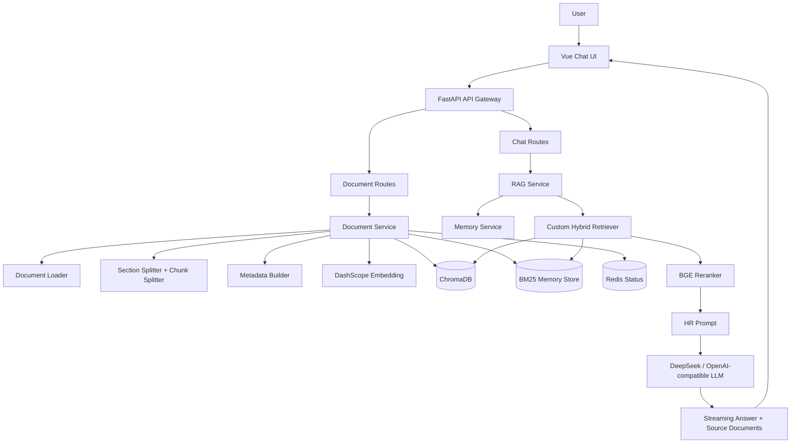
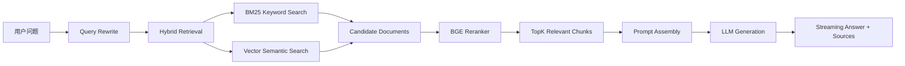
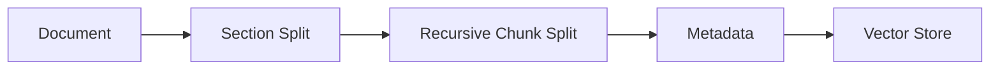
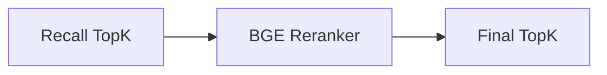
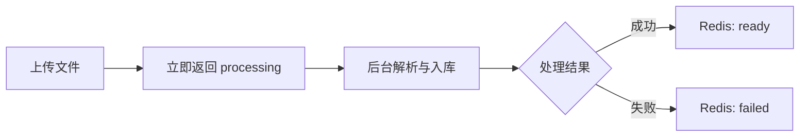

# AI RAG Knowledge Base System

<p align="center">
  <strong>FastAPI + Vue + LangChain + ChromaDB + Redis 的工程化 RAG 知识库问答系统</strong>
</p>

<p align="center">
  
  
  
  
  
  
  
</p>

一个接近生产形态的智能知识库问答系统，支持多格式文档上传、RAG 检索增强生成、多轮对话、流式输出、来源追溯、混合检索、Rerank 重排序、Redis 文档状态管理以及 Docker 化部署。

本项目不是简单的 LLM API 调用 Demo，而是围绕 AI 应用工程、检索工程、后端工程和基础设施实践搭建的完整 RAG 项目。

---

## Table of Contents

- [项目亮点](#项目亮点)
- [技术栈](#技术栈)
- [Demo](#demo)
- [系统架构](#系统架构)
- [RAG Pipeline](#rag-pipeline)
- [检索优化设计](#检索优化设计)
- [核心功能](#核心功能)
- [项目目录结构](#项目目录结构)
- [后端模块说明](#后端模块说明)
- [环境变量](#环境变量)
- [本地启动](#本地启动)
- [Docker 部署](#docker-部署)
- [API 示例](#api-示例)
- [项目难点与解决方案](#项目难点与解决方案)
- [面试可讲亮点](#面试可讲亮点)
- [后续优化方向](#后续优化方向)
- [项目定位](#项目定位)

---

## 项目亮点

| 能力 | 说明 |
| --- | --- |
| 多格式文档上传 | 支持 PDF、DOCX、TXT、CSV、Excel 等文档类型 |
| 向量知识库 | 基于 ChromaDB 构建本地向量数据库 |
| Hybrid Search | BM25 关键词检索 + Vector 语义检索组合召回 |
| Rerank | 使用 BGE Reranker 对候选 chunk 重排序 |
| Section-aware Chunking | 先按文档结构切分，再进行递归 chunk 切分 |
| Metadata Filter | 通过 `user_id` 实现用户级文档隔离 |
| Conversational Memory | 按用户维护多轮对话上下文 |
| Streaming Response | FastAPI `StreamingResponse` 流式返回答案 |
| Source Documents | 返回命中文档、页码、section、chunk、rerank score |
| Async Processing | 文档上传后后台处理，避免接口长时间阻塞 |
| Redis Status | 使用 Redis 管理 `processing / ready / failed` 状态 |
| Docker Compose | 一键启动 Redis 与 FastAPI Backend |

---

## 技术栈

| Layer | Stack |
| --- | --- |
| Frontend | Vue 3, Vite, Axios, Element Plus, CSS |
| Backend | FastAPI, Pydantic, StreamingResponse |
| RAG | LangChain, ChromaDB, BM25, BGE Reranker |
| Model | DashScope Embedding, DeepSeek / OpenAI-compatible LLM |
| Storage | Local Docs, ChromaDB, Redis |
| Infra | Docker, Docker Compose |

---

## Demo

### 1. 上传文档

```bash
curl -X POST "http://localhost:8000/upload" \
  -F "user_id=Joker3e" \
  -F "file=@resume.pdf"
```

返回示例：

```json
{
  "message": "文件上传成功，正在处理中",
  "status": "processing",
  "filename": "resume.pdf"
}
```

### 2. 查看处理状态

```bash
curl "http://localhost:8000/documents?user_id=Joker3e"
```

```json
[
  {
    "filename": "resume.pdf",
    "file_hash": "xxx",
    "status": "ready"
  }
]
```

### 3. 流式问答

```bash
curl -N -X POST "http://localhost:8000/chat_stream" \
  -H "Content-Type: application/json" \
  -d "{\"user_id\":\"Joker3e\",\"question\":\"他的 GPA 是多少？\"}"
```

### 4. 来源追溯

```bash
curl -X POST "http://localhost:8000/sources_history" \
  -H "Content-Type: application/json" \
  -d "{\"user_id\":\"Joker3e\",\"question\":\"他的 GPA 是多少？\"}"
```

---

## 系统架构



---

## RAG Pipeline



---

## 检索优化设计

### 1. Section-aware Chunking

普通字符切分容易造成语义断裂，例如教育经历、项目经历、技能等内容被切散。

本项目在文档解析后先进行结构化 Section Split，再进行 Recursive Chunk Split，使每个 chunk 尽可能保留完整语义结构。



### 2. Hybrid Search

单纯向量检索适合语义问题，但对 GPA、CET、Vue、Redis、JWT 等关键词型问题不稳定。本项目组合两类召回能力：

| Retriever | 适用场景 |
| --- | --- |
| BM25 | 关键词、缩写、技术名词、数字字段 |
| Vector Search | 语义理解、模糊表达、意图匹配 |

### 3. Rerank

Hybrid Search 解决“能否召回”，Rerank 解决“谁最相关”。本项目使用 BGE Reranker 对候选文档重新排序，使最终进入 LLM 的上下文更加精准。



### 4. Metadata Filter

每个 chunk 都包含统一 metadata：

```json
{
  "user_id": "Joker3e",
  "filename": "resume.pdf",
  "saved_filename": "uuid.pdf",
  "file_hash": "xxx",
  "page": 0,
  "section": "教育经历",
  "parent_id": "uuid",
  "chunk_index": 1,
  "document_type": "resume"
}
```

通过 `user_id` filter 实现多用户文档隔离，避免不同用户之间的数据串库。

---

## 核心功能

### 文档上传


### 异步文档处理

上传接口不会长时间阻塞，而是立即返回 `processing`，随后后台解析、切分、入库，并通过 Redis 更新最终状态。



### 文档管理

- 文件列表
- 文件上传
- 文件删除
- 文件去重
- 文档处理状态展示

### 流式问答

后端使用 `StreamingResponse` 返回 LLM 生成内容，前端实时显示 AI 回复。

### 来源追溯

每次回答后返回相关来源文档，包括：

- 文件名
- 页码
- section
- chunk 内容
- rerank score

---

## 项目目录结构

```text
ai-rag-demo/
├── main.py
├── Dockerfile
├── docker-compose.yml
├── requirements.txt
├── requirements-prod.txt
├── config/
│   └── rag_config.py
├── routes/
│   ├── admin_debug_routes.py
│   ├── chat_routes.py
│   └── document_routes.py
├── services/
│   ├── rag_service.py
│   ├── document_service.py
│   ├── memory_service.py
│   └── redis_service.py
├── retrievers/
│   ├── custom_retriever.py
│   ├── bm25_store.py
│   ├── context_compressor.py
│   ├── query_rewriter.py
│   └── reranker.py
├── splitters/
│   ├── resume_splitter.py
│   └── chunk_splitter.py
├── loaders/
│   └── document_loader.py
├── prompts/
│   └── hr_prompt.py
├── schemas/
│   └── chat_schema.py
├── utils/
│   ├── metadatas.py
│   └── text_cleaner.py
├── docs/
├── models/
└── chroma_db/
```

---

## 后端模块说明

| Module | Responsibility | Key Files |
| --- | --- | --- |
| `routes` | API 路由层，只处理请求与响应 | `chat_routes.py`, `document_routes.py`, `admin_debug_routes.py` |
| `services` | 业务逻辑层 | `rag_service.py`, `document_service.py`, `memory_service.py`, `redis_service.py` |
| `retrievers` | 检索增强能力 | `custom_retriever.py`, `bm25_store.py`, `reranker.py`, `query_rewriter.py` |
| `splitters` | 文档切分 | `resume_splitter.py`, `chunk_splitter.py` |
| `loaders` | 文档加载与解析 | `document_loader.py` |
| `prompts` | Prompt 模板 | `hr_prompt.py` |
| `schemas` | 请求/响应结构 | `chat_schema.py` |
| `utils` | 通用工具 | `metadatas.py`, `text_cleaner.py` |

---

## 环境变量

后端 `.env` 示例：

```env
DASHSCOPE_API_KEY=your_dashscope_api_key
DEEPSEEK_API_KEY=your_deepseek_api_key
DEEPSEEK_BASE_URL=https://api.deepseek.com
REDIS_HOST=localhost
REDIS_PORT=6379
```

Docker 环境中：

```env
REDIS_HOST=redis
REDIS_PORT=6379
```

前端 `.env.development` 示例：

```env
VITE_API_BASE_URL=http://127.0.0.1:8000
```

前端 `.env.production` 示例：

```env
VITE_API_BASE_URL=http://localhost:8000
```

---

## 本地启动

### 1. 启动 Redis

```bash
docker compose up -d redis
```

### 2. 启动后端

```bash
python main.py
```

或者：

```bash
uvicorn main:app --reload --host 0.0.0.0 --port 8000
```

后端接口文档：

```text
http://localhost:8000/docs
```

### 3. 启动前端

```bash
npm install
npm run dev
```

---

## Docker 部署

### 启动后端与 Redis

```bash
docker compose up -d --build
```

### 查看容器状态

```bash
docker compose ps
```

### 查看后端日志

```bash
docker compose logs -f backend
```

---

## API 示例

| Method | Endpoint | Description |
| --- | --- | --- |
| `POST` | `/upload` | 上传文档并进入后台处理 |
| `GET` | `/documents?user_id=Joker3e` | 获取用户文档列表与处理状态 |
| `DELETE` | `/delete_document?user_id=Joker3e&file_hash=xxx` | 删除指定文档 |
| `POST` | `/chat_stream` | 流式问答 |
| `POST` | `/sources_history` | 获取来源文档与历史上下文 |

### 上传文档

```http
POST /upload
Content-Type: multipart/form-data
```

参数：

```text
user_id: string
file: UploadFile
```

返回：

```json
{
  "message": "文件上传成功，正在处理中",
  "status": "processing",
  "filename": "resume.pdf"
}
```

### 获取文档列表

```http
GET /documents?user_id=Joker3e
```

返回：

```json
[
  {
    "filename": "resume.pdf",
    "file_hash": "xxx",
    "status": "ready"
  }
]
```

### 删除文档

```http
DELETE /delete_document?user_id=Joker3e&file_hash=xxx
```

### 流式问答

```http
POST /chat_stream
```

请求：

```json
{
  "user_id": "Joker3e",
  "question": "他的 GPA 是多少？"
}
```

### 获取来源

```http
POST /sources_history
```

返回：

```json
{
  "sources": [
    {
      "filename": "resume.pdf",
      "page": 0,
      "section": "教育经历",
      "content": "GPA：3.33/4.00",
      "rerank_score": -3.46
    }
  ]
}
```

---

## 项目难点与解决方案

| 问题 | 解决方案 |
| --- | --- |
| 向量检索对 GPA、CET、Vue、Redis 等关键词不稳定 | 引入 BM25，与向量检索组合成 Hybrid Search |
| Hybrid Search 能提高召回，但排序不一定最精准 | 引入 BGE Reranker，对候选 chunk 重新排序 |
| 多用户文档进入同一个向量库可能串库 | 所有 chunk 写入 `user_id`，检索阶段使用 metadata filter |
| 文档解析、切分、embedding 耗时较长 | 使用 `BackgroundTasks` 异步处理文档，并用 Redis 保存状态 |
| import 阶段加载 BGE Reranker 影响启动 | 使用 Lazy Load，第一次真正执行 rerank 时再加载模型 |

---

## 面试可讲亮点

- 不是简单调用 LLM API，而是完整实现了 RAG 检索增强生成链路
- 使用 Hybrid Search 解决向量检索对关键词不敏感的问题
- 使用 BGE Reranker 提升 TopK 上下文排序质量
- 使用 Metadata Filter 实现用户级知识库隔离
- 使用 Redis 管理异步文档处理状态
- 使用 BackgroundTasks 避免上传大文件时接口阻塞
- 使用 Docker Compose 管理 Redis 与 FastAPI 服务
- 后端采用模块化分层设计，提升可维护性

---

## 后续优化方向

- 引入 Celery + Redis 实现更可靠的异步任务队列
- 引入 PostgreSQL 持久化用户、文档、任务状态
- 引入对象存储 OSS / MinIO 保存原始文档
- 支持 WebSocket / SSE 同时返回 token、sources、events
- 引入权限系统与 JWT 登录
- 优化前端 Docker + Nginx 生产部署
- 引入 Agent 能力，支持工具调用与自动化任务
- 增加 RAG Evaluation，对召回率和回答准确率进行评估

---

## 项目定位

本项目定位为一个面向 AI 全栈工程实践的 RAG 知识库系统，重点展示：

```text
AI Application Engineering
+
Retrieval Engineering
+
Backend Engineering
+
Docker Infrastructure
```

适合作为 AI 全栈工程师、RAG 应用工程师、LLM 应用开发岗位的项目展示。
