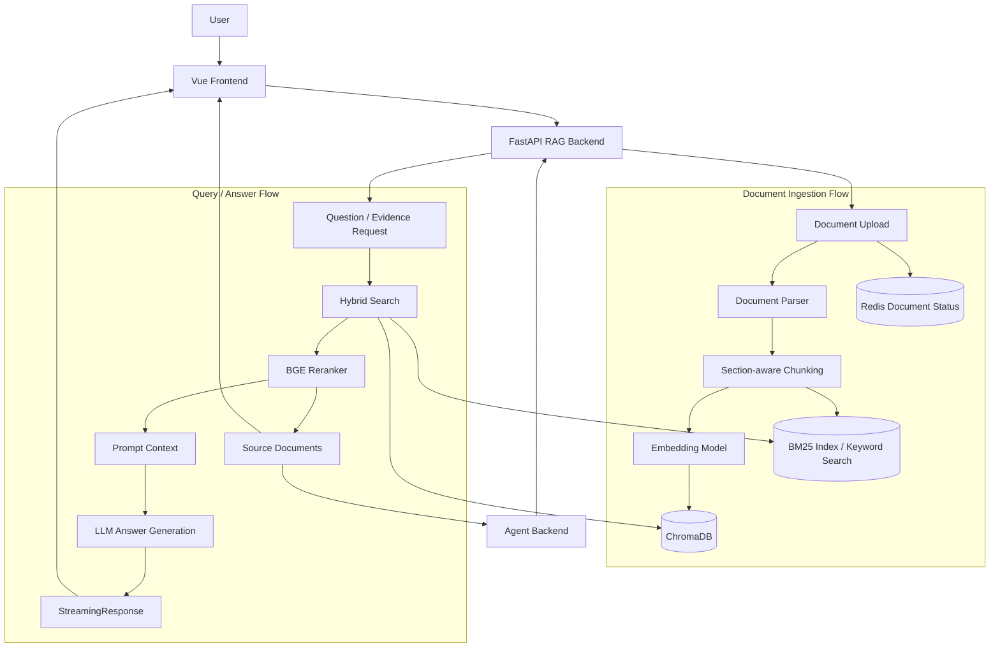

# AI RAG Knowledge Base Backend

Personal Project / 个人独立项目：一个用于验证文档解析、切分、Embedding、Hybrid Search、Rerank、流式问答和来源追溯链路的 FastAPI RAG 知识库后端。

本仓库是 **Local / Docker Compose deployment for personal project demonstration**。它不是生产级高可用知识库平台，也不是大规模向量检索系统。

## 1. Project Overview / 项目简介

`ai-rag-knowledge-base-backend` 是一个个人独立开发的 RAG 后端项目，面向企业文档问答、简历知识库、技术文档问答等场景，用来验证一条从文档上传到检索增强生成的工程化链路。

当前项目覆盖的核心链路：

- 多格式文档上传与解析：PDF、TXT、DOCX、CSV、XLSX、XLS；`.doc` 当前会提示转换为 `.docx`。
- 文档解析、Section-aware Chunking、Embedding、写入 ChromaDB。
- BM25 keyword search + Chroma vector search 的 Hybrid Search。
- 基于本地 `bge-reranker-v2-m3` 模型的二阶段 rerank。
- FastAPI `StreamingResponse` 流式回答。
- 返回 source documents，包括文件名、页码、section、chunk index、rerank score。
- 基于 `user_id` metadata filter 的用户级文档隔离。
- Redis 文档处理状态管理：`processing / ready / failed`。
- `retrieve_evidence` API，供 Agent 后端作为 Resume RAG 工具调用。

## 2. Repository Role / 当前仓库定位

当前仓库只负责 RAG 后端能力：document ingestion、retrieval、rerank、answer generation 和 source trace。

相关仓库：

- Frontend: [https://github.com/Joker3e3/ai-agent-rag-frontend](https://github.com/Joker3e3/ai-agent-rag-frontend)
- Agent Backend: [https://github.com/Joker3e3/ai-career-agent-backend](https://github.com/Joker3e3/ai-career-agent-backend)
- RAG Backend: [https://github.com/Joker3e3/ai-rag-knowledge-base-backend](https://github.com/Joker3e3/ai-rag-knowledge-base-backend)

调用关系：

- Frontend 调用当前仓库进行文档上传、文档列表查询、知识库问答和来源展示。
- Agent Backend 调用当前仓库的 `/retrieve_evidence` API，把它作为 Resume RAG 工具，根据岗位 JD 或分析任务检索简历证据。
- 当前仓库不负责 Agent Workflow、JD 分析编排或报告生成，只负责 RAG ingestion / retrieval / answer generation。

## 3. Architecture / 系统架构



### Document Ingestion Flow

```text
Upload -> Parse -> Section-aware Chunking -> Recursive Chunking
       -> Embedding -> ChromaDB
       -> BM25 memory index
       -> Redis Status
```

### Query / Answer Flow

```text
Question -> BM25 + Vector Search -> Rerank -> Prompt Context
         -> LLM -> Streaming Answer -> Source Documents
```

## 4. 多仓库启动顺序

当前系统由以下三个仓库共同组成：

1. 启动 RAG 知识库后端：`ai-rag-knowledge-base-backend`
   - 默认地址：`http://localhost:8000`

2. 启动 Agent 后端：`ai-career-agent-backend`
   - 默认地址：`http://localhost:8001`

3. 启动前端项目：`ai-agent-rag-frontend`
   - 默认地址：`http://localhost:5173`

### 服务依赖关系

- Agent 后端通过 `RAG_SERVICE_URL` 调用 RAG 知识库服务，实现简历检索与证据获取能力。
- 前端项目同时调用 Agent 后端与 RAG 后端接口：
  - `VITE_AGENT_API_BASE_URL`
  - `VITE_RAG_API_BASE_URL`

### 整体调用链路

```text
Vue Frontend
    v
Agent Backend
    v
RAG Backend
    v
ChromaDB / Embedding / Retrieval
```

其中：

- Agent Backend 负责 JD 分析、Workflow 编排、报告生成、运行状态管理等能力。
- RAG Backend 负责文档解析、向量化入库、Hybrid Search、Rerank 和问答检索能力。
- Frontend 负责文档管理、知识库问答、JD 分析提交、任务状态轮询与结果展示。

> 文档上传、文档状态查询和知识库问答页面也可以由 Frontend 直接调用 RAG Backend。

## 5. Core Features / 核心功能

- 多格式文档上传与解析：基于 LangChain document loaders，支持 PDF、TXT、DOCX、CSV、XLSX、XLS。
- Section-aware Chunking：先按简历/文档 section 拆分，再用 recursive splitter 切成适合 embedding 的 chunk。
- Embedding 与 ChromaDB 入库：使用 DashScope `text-embedding-v4`，向量数据保存到本地 `./chroma_db`。
- BM25 + Vector Hybrid Search：BM25 关键词召回与 Chroma 向量召回加权组合。
- BGE Reranker：使用本地 `./models/bge-reranker-v2-m3`，对候选 chunk 二阶段排序。
- StreamingResponse 流式回答：`/chat_stream` 以 text stream 返回 LLM 输出。
- Source Documents 返回：`/sources_history` 返回 page、section、chunk_index、parent_id、rerank_score 等信息。
- `user_id` 文档隔离：检索阶段通过 Chroma metadata filter 和用户级 BM25 docs 做隔离。
- Redis 文档状态：上传后先返回 `processing`，后台处理完成后更新为 `ready` 或 `failed`。
- Evidence retrieval API：`/retrieve_evidence` 供 Agent 后端检索候选证据。

## 6. Tech Stack / 技术栈

Backend:

- FastAPI
- Pydantic
- Uvicorn
- LangChain

RAG / AI:

- ChromaDB
- DashScope Embeddings `text-embedding-v4`
- BM25 (`rank-bm25` / LangChain BM25Retriever)
- BGE Reranker (`FlagEmbedding`, local `bge-reranker-v2-m3`)
- DeepSeek / OpenAI-compatible LLM API
- FastAPI `StreamingResponse`

State / Storage:

- Redis
- Local `docs/` upload directory
- Local ChromaDB directory `chroma_db/`
- In-memory conversation buffer and BM25 index rebuilt from Chroma at startup

Infra:

- Docker
- Docker Compose

Frontend Integration:

- 当前仓库不包含前端。
- 配套前端为 `ai-agent-rag-frontend`。

## 7. Project Structure / 目录结构

```text
ai-rag-knowledge-base-backend/
|-- main.py
|-- Dockerfile
|-- docker-compose.yml
|-- requirements.txt
|-- requirements-prod.txt
|-- config/
|   `-- rag_config.py
|-- routes/
|   |-- chat_routes.py
|   |-- document_routes.py
|   |-- tool_routes.py
|   `-- admin_debug_routes.py
|-- services/
|   |-- document_service.py
|   |-- rag_service.py
|   |-- redis_service.py
|   `-- memory_service.py
|-- loaders/
|   `-- document_loader.py
|-- splitters/
|   |-- resume_splitter.py
|   `-- chunk_splitter.py
|-- retrievers/
|   |-- custom_retriever.py
|   |-- bm25_store.py
|   |-- reranker.py
|   |-- query_rewriter.py
|   `-- context_compressor.py
|-- schemas/
|   `-- chat_schema.py
|-- prompts/
|   `-- hr_prompt.py
|-- utils/
|   |-- metadatas.py
|   `-- text_cleaner.py
|-- docs/
|-- models/
`-- chroma_db/
```

关键目录说明：

- API routers: `routes/document_routes.py`、`routes/chat_routes.py`、`routes/tool_routes.py`；`routes/admin_debug_routes.py` 是调试路由文件，当前没有在 `main.py` 中挂载。
- 文档解析: `loaders/document_loader.py`。
- Section-aware chunking: `splitters/resume_splitter.py`。
- Recursive chunking: `splitters/chunk_splitter.py`。
- Embedding / vector store: `services/rag_service.py`。
- 文档上传、去重、入库、删除: `services/document_service.py`。
- Hybrid retrieval / rerank: `retrievers/custom_retriever.py`、`retrievers/bm25_store.py`、`retrievers/reranker.py`。
- Redis 状态管理: `services/redis_service.py` 和 `services/document_service.py` 中的 document status helpers。
- Runtime data: `docs/`、`models/`、`chroma_db/` 被 `.gitignore` 忽略，不作为源码提交。

## 8. Quick Start / 快速启动

### 8.1 Clone

```bash
git clone https://github.com/Joker3e3/ai-rag-knowledge-base-backend.git
cd ai-rag-knowledge-base-backend
```

### 8.2 Prepare environment

复制 `.env.example`，并填入实际 API key：：

````bash
cp .env.example .env

```env
DASHSCOPE_API_KEY=your_dashscope_api_key
DEEPSEEK_API_KEY=your_deepseek_api_key
DEEPSEEK_BASE_URL=https://api.deepseek.com
REDIS_HOST=localhost
REDIS_PORT=6379
````

Docker Compose 启动时，`REDIS_HOST` 应配置为 Compose service name：

```env
REDIS_HOST=redis
REDIS_PORT=6379
```

### 准备本地 Reranker 模型

项目使用本地 BGE Reranker 模型进行二阶段重排序。

首次运行前需手动下载模型，并放置到Reranker 依赖本地模型目录：

```text
models/bge-reranker-v2-m3/
```

未准备模型时，Reranker 功能将无法正常工作。

### 8.3 Docker Compose start

```bash
docker compose up -d --build
```

查看服务状态：

```bash
docker compose ps
```

查看后端日志：

```bash
docker compose logs -f backend
```

访问 API docs：

```text
http://localhost:8000/docs
```

### 8.4 Local Python start

```bash
pip install -r requirements.txt
docker compose up -d redis
python main.py
```

或：

```bash
uvicorn main:app --reload --host 0.0.0.0 --port 8000
```

### 8.5 与前端、Agent 后端联调

Agent Backend `.env` 中配置：

```env
RAG_SERVICE_URL=http://localhost:8000
```

Frontend `.env` 中配置：

```env
VITE_RAG_API_BASE_URL=http://localhost:8000
VITE_AGENT_API_BASE_URL=http://localhost:8001
```

推荐启动顺序：

```text
1. RAG Backend + Redis
2. Agent Backend
3. Frontend
```

## 9. Environment Variables / 环境变量

当前实际代码读取的环境变量：

| Variable            | Required | Purpose                                                       |
| ------------------- | -------- | ------------------------------------------------------------- |
| `DASHSCOPE_API_KEY` | Yes      | DashScope embedding API key，用于 `text-embedding-v4`。       |
| `DEEPSEEK_API_KEY`  | Yes      | LLM API key。                                                 |
| `DEEPSEEK_BASE_URL` | Yes      | OpenAI-compatible LLM base URL。                              |
| `REDIS_HOST`        | No       | Redis host，默认 `localhost`；Docker Compose 中使用 `redis`。 |
| `REDIS_PORT`        | No       | Redis port，默认 `6379`。                                     |

代码中固定或配置文件中定义的运行参数：

| Config                  | Current value                                    | Source                    |
| ----------------------- | ------------------------------------------------ | ------------------------- |
| Service port            | `8000`                                           | `main.py`, `Dockerfile`   |
| CORS origins            | `http://localhost:5173`, `http://127.0.0.1:5173` | `main.py`                 |
| Embedding model         | `text-embedding-v4`                              | `services/rag_service.py` |
| LLM model               | `deepseek-chat`                                  | `services/rag_service.py` |
| Reranker path           | `./models/bge-reranker-v2-m3`                    | `retrievers/reranker.py`  |
| ChromaDB directory      | `./chroma_db`                                    | `config/rag_config.py`    |
| Uploaded docs directory | `./docs`                                         | `config/rag_config.py`    |
| Chunk size / overlap    | `500 / 50`                                       | `config/rag_config.py`    |
| Recall / rerank top K   | `10 / 3`                                         | `config/rag_config.py`    |
| BM25 / Vector weight    | `0.5 / 0.5`                                      | `config/rag_config.py`    |

Do not commit real API keys. `.env` is already ignored by `.gitignore`.

## 10. API / Usage Example

### Upload document

上传文档后立即返回 `processing`，后台继续解析、切分、embedding 和入库。

```bash
curl -X POST "http://localhost:8000/upload" \
  -F "user_id=Joker3e" \
  -F "file=@resume.pdf"
```

Response:

```json
{
  "message": "文件上传成功，正在处理中",
  "status": "processing",
  "filename": "resume.pdf"
}
```

### Query document status

```bash
curl "http://localhost:8000/documents?user_id=Joker3e"
```

Response:

```json
[
  {
    "filename": "resume.pdf",
    "file_hash": "md5_hash",
    "status": "ready"
  }
]
```

### Delete document

```bash
curl -X DELETE "http://localhost:8000/delete_document?user_id=Joker3e&file_hash=md5_hash"
```

### Streaming knowledge base chat

`/chat_stream` 会执行 Hybrid Search、Rerank、Prompt assembly 和 LLM streaming generation。

```bash
curl -N -X POST "http://localhost:8000/chat_stream" \
  -H "Content-Type: application/json" \
  -d "{\"user_id\":\"Joker3e\",\"question\":\"请总结这个候选人的项目经历\"}"
```

### Source trace

`/sources_history` 返回当前问题命中的来源片段和最近对话历史。

```bash
curl -X POST "http://localhost:8000/sources_history" \
  -H "Content-Type: application/json" \
  -d "{\"user_id\":\"Joker3e\",\"question\":\"这个候选人是否使用过 Redis？\"}"
```

Response shape:

```json
{
  "chat_history": [],
  "sources": [
    {
      "source": "docs/xxx.pdf",
      "page": 0,
      "content": "source chunk preview",
      "filename": "resume.pdf",
      "user_id": "Joker3e",
      "section": "项目经历",
      "chunk_index": 3,
      "parent_id": "uuid",
      "rerank_score": 0.42
    }
  ]
}
```

### Evidence retrieval API

Agent Backend 使用该接口获取 Resume RAG 证据，不直接生成最终报告。

```bash
curl -X POST "http://localhost:8000/retrieve_evidence" \
  -H "Content-Type: application/json" \
  -d "{\"user_id\":\"Joker3e\",\"question\":\"候选人有哪些后端项目经验？\"}"
```

Response shape:

```json
{
  "evidence": [
    {
      "content": "matched chunk content",
      "metadata": {
        "filename": "resume.pdf",
        "section": "项目经历",
        "chunk_index": 1,
        "rerank_score": 0.38
      }
    }
  ]
}
```

## 11. Design Notes / 设计说明

### 11.1 为什么做 Section-aware Chunking

长文档如果只按固定字符数切分，容易把教育经历、项目经历、技能列表等语义结构切碎。当前项目先按 section 识别文档结构，再用 recursive splitter 做 chunking，尽量保留章节上下文。

### 11.2 为什么做 Hybrid Search

纯向量检索对专有名词、岗位术语、技术关键词、缩写和数字有时不稳定。例如 GPA、CET、Redis、Vue 等关键词需要精确召回。BM25 能补关键词召回，Vector Search 能补语义召回，两者组合更适合简历和技术文档检索。项目中 BM25 与向量召回结果按权重进行融合，默认权重为 0.5 / 0.5，后续可根据场景进行调整。

### 11.3 为什么接入 Reranker

Hybrid Search 负责扩大候选召回，但召回结果中仍可能包含低相关 chunk。BGE Reranker 作为二阶段排序模块，用来筛选更适合进入 Prompt 的上下文，减少无关内容对回答的干扰。

### 11.4 为什么返回 Source Documents

RAG 输出需要可解释和可核查。返回来源文档、页码、section、chunk 和 rerank score，方便用户确认答案依据，也方便调试检索质量。

### 11.5 为什么用 Redis 记录文档状态

文档解析、切分、embedding 和入库是异步且可能耗时的过程。上传接口先返回 `processing`，前端可以轮询 `/documents` 展示 `processing / ready / failed` 状态，避免请求长时间阻塞。

### 11.6 为什么用 metadata filter 做 user_id 隔离

个人项目中采用轻量方式实现用户级文档隔离：每个 chunk 写入 `user_id`，检索时使用 metadata filter 和用户级 BM25 文档池，避免跨用户文档污染。它不是完整企业级权限系统。

## 12. Demo Screenshots

### RAG Upload


### RAG Chat


## 13. Current Limitations / 当前边界

- Personal project, not production-grade。
- ChromaDB 使用本地单机目录 `./chroma_db`，不是高可用向量数据库部署。
- Docker Compose 只启动 Redis 和当前 FastAPI 后端，不包含三仓库完整编排。
- BM25 index 是进程内内存结构，启动时从 Chroma 重建。
- Conversation memory 是进程内 `ConversationBufferWindowMemory`，未持久化。
- 当前没有 API 鉴权，不建议直接作为公网服务运行。
- 当前用户隔离基于 metadata filter，不是完整企业级权限系统。
- 没有大规模 benchmark，也没有完整自动化 RAG evaluation 体系。
- OCR、复杂 PDF 版面、多栏排版和复杂表格解析能力有限。
- `.doc` 文件当前不是真正支持的解析格式，建议转换为 `.docx` 后上传。
- Reranker 依赖本地模型文件和 CPU 推理，首次加载和 rerank latency 需要单独优化。

## 14. Roadmap / 后续计划

- 增加 `.env.example` 和模型准备说明，降低本地复现成本。
- 增加 RAG case evaluation，覆盖召回质量、来源准确性和回答稳定性。
- 增强 PDF 表格、多栏文本和可选 OCR 解析能力。
- 增加 Parent Document Retrieval / Contextual Retrieval。
- 增加 API 鉴权和更严格的用户权限边界。
- 增加日志、tracing 和 reranker latency profiling。
- 补充 Docker Compose 三仓库联调文档。

## 15. Security Notes / 安全说明

- API keys should be stored in `.env`。
- `.env` should never be committed。
- `.env.example` should only contain placeholders。
- 当前 `.gitignore` 已忽略 `.env`、`docs/`、`models/`、`chroma_db/` 等本地运行数据。
- 如果历史提交中泄露过 key，应立即轮换相关 API key。
